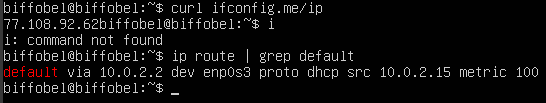
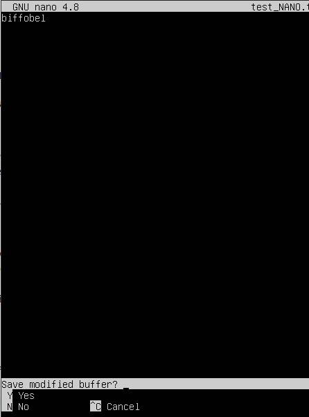

## Part 1.Установка ОС
1. Узнаем версию Ubuntu после установки, выполнив команду: `cat /etc/issue.`  
 

## Part 2. Создание пользователя
1.  Создадим пользователя second_admin и добавим его в группу adm:  

2. Проверим добавление нового пользователя в файле `/etc/passwd` 

## Part 3. Настройка сети ОС
1. Было задано название машины вида user-1:  
  
2. Установил временную зону, соответствующую текущему местоположению:  

3. Вывод названия сетевых интерфейсов:  

- `lo (loopback device) – виртуальный интерфейс, присутствующий по умолчанию в любом Linux. Он используется для отладки сетевых программ и запуска серверных приложений на локальной машине. С этим интерфейсом всегда связан адрес 127.0.0.1. У него есть dns-имя – localhost.`

4. Получил ip адрес устройства от DHCP сервера:  

- `DHCP (англ. Dynamic Host Configuration Protocol протокол динамической конфигурации узла) это сетевой протокол, позволяющий компьютерам автоматически получать IP-адрес и другие параметры, необходимые для работы в сети TCP/IP`

5. Вывел внешний ip-адрес шлюза (ip) с помощью команды `curl ifconfig.me/ip`, которая отправляет GET-запрос на сайт и считывает с него необходимую инфомацию, а также внутренний IP-адрес шлюза с помощью команды `ip route`  

6. Установка статических настроек ip, gw, dns  
- С помощью команды sudo vim /etc/netplan/00-installer-config.yaml получил доступ к файлу конфигурации  
  

- После чего в этом файле сделал `dhcp4: false` чтобы ip автоматически не генерировался и задал собственные значения  
  

7. Для проверки изменений после перезагрузки машины снова вызовем команду `ip route` и увидим, что наш интерфейс стал статическим  

- Также проверим состояние dns-серверов с помощью команды `resolvectl status`  

- Пропингуем адреса 1.1.1.1 и ya.ru с помощью команды `ping -c 5 (address)`, установив количественное ограничение отправленных пакетов = 5  

## Part 4. Обновление ОС
 - Успешно обновлены системыне пакеты 
 

## Part 5. Использование команды sudo
- `Sudo – это утилита для операционных систем семейства Linux, позволяющая пользователю запускать программы с привилегиями суперпользователя. Использование sudo позволяет выполнять привилегированные команды обычным пользователям без необходимости ввода пароля суперпользователя root .`   

- Я предоставил новому пользователю права sudo с помощью команды ``sudo usermod -aG sudo second_admin``, где флаг `-a` означает добавление в группу, а `-G` позволяет не удалять пользователя из уже существующих групп. Далее я вошел в другого пользователя и изменил hostname:  

## Part 6. Установка и настройка службы времени
- Вывод команды с корректным временем: 

## Part 7. Установка и использование текстовых редакторов
- В системе уже установлены редакторы VIM и nano, отдельно установим редактор JOE с помощью команды `sudo apt install joe`

1. Выход из файла с сохранением содержимого

    -  Для создания файла в VIM пропишем команду `vim test_VIM.txt`. Для входа в режим редактирования необходимо нажать клавишу `I`, для выхода - `esc`.
    Для выхода из утилиты с сохранением необходимо ввести `:wq`  
    

    - Для создания файла в NANO пропишем команду `nano test_NANO.txt`. Для выхода с cохранением необходимо нажать `CTRL + x`, затем `y` и `enter`.  
    
    
    - Для создания файла в JOE пропишем команду `joe test_JOE.txt`. Для выхода с cохранением необходимо нажать `CTRL + K`, затем `Q` -> `y`.  
    

2. Выход без сохранения

    - Для выхода без сохранения из VIM необходимо написать `:q!`: 
    

    - Для выхода без сохранения из NANO необходимо нажать `CTRL + x`, затем `n`: 
    

    - Для выхода без сохранения из JOE необходимо нажать `CTRL + C`, затем `y`: 
    

3. Поиск по содержимому файла и замена слов

    1. - Для поиска в утилите VIM необходимо ввести `/текст`, который хотим найти:  
    
    
       - Для замены необходимо сделать: `:s/<что хотим изменить>/<на что хотим заменить>`:  
       

    2. - Для поиска в утилите NANO необходимо нажать `CTRL + W`, а затем `enter`: 
        

        - Для замены: `CTRL + \ + <что хотим изменить + enter> + <на что хотим заменить + enter> + A(для замены все вхождения) или y и n по отдельности`:  
        

    3. - Для поиска в утилите NANO необходимо нажать `^K, F -> паттерн для поиска -> I`:  
        

        - Для замены: `^K, F -> что заменить -> R -> на что заменить -> Y`: 
        

## Part 8. Установка и базовая настройка сервиса SSHD

1. Для установки службы SSHd я воспользовался командами _`sudo apt-get install ssh`_ и _`sudo apt install openssh-server`_ 
2. Для добавления автостарта службы при загрузке системы я использовал команду ___sudo systemctl start ssh___

3. Перенастройка cлужбы SSHd на порт 2022 производилась через редактирование файла sshd_config: `sudo vim /etc/ssh/sshd_config`: 

4. Команда ps используется для вывода текущего списка работающих процессов в системе.
Для того, чтобы найти процесс sshd, мы воспользуемся флагом **-e**, который показывает все процессы в системе:  

    
5. После перезагрузки системы вызовем команду `netstat -tan`. Значения флагов:  
**-a** - Показывает состояние всех сокетов; обычно сокеты, используемые серверными процессами, не показываются.  
**-n** - Показывает сетевые адреса как числа. netstat обычно показывает адреса как символы.  
**-t** - Отображает TCP подключения  
Из этого можно сделать вывод, что команда покажет все текущие TCP-соединения, как числовые значения IP-адресов и портов, включая прослушивающие порты.   
  
**Proto** - Содержит тип протокола 
**Recv-Q** - Счётчик байтов не скопированных программой пользователя из этого сокета. 
**Send-Q** - Счётчик байтов, не подтверждённых удалённым узлом. 
**Local Address** - Адрес и номер порта локального конца сокета. 
**Foreign Address** - Адрес и номер порта удалённого конца сокета. 
**State** - Состояние сокета.  
`LISTEN` Сокет ожидает входящих подключений.  
**0.0.0.0** -  это немаршрутизируемый адрес IPv4, который используется в качестве адреса по умолчанию или адреса-заполнителя.

## Part 9. Установка и использование утилит top, htop
1. Вывод команды top:
    - Uptime (время после загрузки): 39 min 
    - 1 user 
    - Общая загрузка системы (load average): 0.00, 0.00, 0.00 
    - Общее количество процессов (tasks): 96 total 
    - Загрузка CPU: %CPU(s): 0,0 us, 0,0 sy, 0,0 ni, 100,0 id, 0,2 wa, 0,0 si, 0,0 st  
    - Загрузка MEM (MiB Mem): 1971,6 total 1360,1 free 145 used: 466.5 buff/cache 
    - PID процесса, занимающего больше памяти - 1392 (сортируем клавишей М) 
    - PID процесса, занимающего больше всего процессорного времени - 1383 (root) 

2. Вывод команды htop (для сортировки используем клавишу **f6** и выбираем необходимый параметр): 
    - ``Сортировка по PID`` 
      
    - ``Сортировка по PERCENT_CPU`` 
      
    - ``Сортировка по PERCENT_MEM`` 
      
    - ``Сортировка по TIME`` 
      
    - ``Фильтр по процессу sshd (клавиша f4)`` 
      
    - ``Поиск процесса syslog (клавиша f3)`` 
      
    - ``Добавлен вывод hostname, clock и uptime (клавиша f2)`` 
      

## Part 10. Использование утилиты fdisk
- Disk /dev/sda, size: 10 GiB, 10737418240 bytes, 20971520 sectors 
  
- Чтобы узнать размер swap, можно использовать команду `free -h`, флаг **-h** нужен для преобразования размера в удобный для чтения вид. Размер swap 1,4 Gb: 
 

## Part 11. Использование утилиты df
1. Запустить команду df.  
Единица измерения в выводе - **байты** 

2. Запустить команду df -Th.  
Файловая система в выводе - ext4  

## Part 12. Использование утилиты du
1. Вывод размера папок /home, /var, /var/log (в байтах, в человекочитаемом виде). Для нахождения суммарного размера вложенных файлов испольуем флаг **-s**, а для приведения к удобному выводу размера - флаг **-h**  

2. Вывод размера всего содержимого в /var/log  

## Part 13. Установка и использование утилиты ncdu

1. Установим утилиту с помощью команды `sudo apt install ncdu`

2. - Вывод размера папки /home  
    

    - Вывод размера папки /var  
    

    - Вывод размера папки /var/log  
    

## Part 14. Работа с системными журналами
1. Открыть для просмотра: 
    - sudo vim /var/log/dmesg  
    - sudo vim /var/log/syslog  
    - sudo vim /var/log/auth.log  

2.  Время последней успешной авторизации - 01:08:21  
Имя пользователя - biffobel  
Метод входа в систему - by LOGIN (uid=0)  

3. Перезапуск SSHd - `sudo systemctl restart ssh`
    Подтверждение можно найти в файле /var/log/syslog  
    

## Part 15. Использование планировщика заданий CRON
1. Используя планировщик заданий, запустите команду uptime через каждые 2 минуты. С помощью команды `crontab -e` отредактируем планировщик задач:  

2. Найдем в системных журналах строчки о выполнении (файл var/log/syslog): 

3. Выведем список активных задач:  

4. Удалим все задания из планировщика заданий: 

