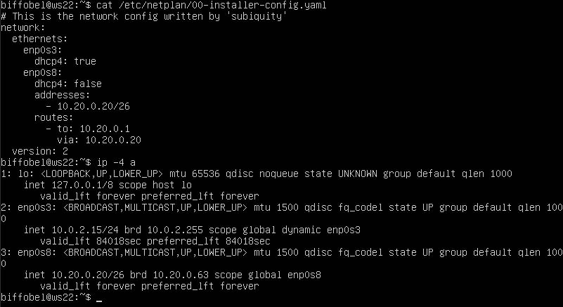
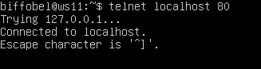

## Part 1. Инструмент ipcalc
### 1.1 Сети и маски
1) Адрес сети 192.167.38.54/13: 192.160.0.0 <br>
<br>

2) *Перевод маски*:
```
* 255.255.255.0 = 11111111.11111111.11111111.00000000 = /24
* /15 = 255.254.0.0 = 11111111.11111110.00000000.00000000
* 11111111.11111111.11111111.11110000 = 255.255.255.240 = /28
```

3) Минимальный и максимальный хост в сети 12.167.38.4 при масках.
С помощью команды `ipcalc 12.167.38.4/mask` можем узнать минимальный и максимальный хост:

`Маска /8`<br>
<br>

`Маска 11111111.11111111.00000000.00000000`<br>
<br>

`Маска 255.255.254.0`<br>
<br>

`Маска /4`<br>
<br>

### 1.2 localhost
Для обращения к локальному приложению, работающему на localhost, только IP-адрес 127.0.0.1 (и альтернативные адреса в диапазоне 127.x.x.x) будут действительными =>
верные ip: `127.0.0.2, 127.1.0.1`.

### 1.3 Диапазоны и сегменты сетей
1. В качестве частных ip-адресов есть зарезервированные диапазоны:

    Класс А: 10.0.0.0 – 10.255.255.255
    Класс Б: 172.16.0.0 – 172.31.255.255
    Класс С: 192.168.0.0 – 192.168.255.255
    loopback интерфейсы (localhost): 127.0.0.0 — 127.255.255.255 

Следовательно в качестве частных ip-адресов будут выступать: `10.0.0.45, 192.168.4.2, 172.20.250.4, 172.16.255.255, 10.10.10.10`.

В качестве публичных ip-адресов выступают: `134.43.0.2, 172.0.2.1, 192.172.0.1, 172.68.0.2, 192.169.168.1`.

2. У сети 10.10.0.0/18 возможны следующие ip-адреса шлюзов: 


## Part 2. Статическая маршрутизация между двумя машинами
- У первой машины изменим hostname на ws1 в файле `/etc/hostname` и перезагрузим систему

- С помощью команды ```ip a``` посмотрим существующие сетевые интерфейсы: <br>
    * **ws1**:<br>
    
    * **ws2**:<br>
    

- Зададим следующие адреса и маски: ws1 - 192.168.100.10, маска /16, ws2 - 172.24.116.8, маска /12, внеся соответствующие изменения в файл `etc/netplan/00-installer-config.yaml`. Также выполним команду `sudo netplan apply` для перезапуска сервиса сети:<br>
    * **ws1**:<br>
    <br>
    * **ws2**:<br>
    

### 2.1 Добавление статического маршрута вручную

* Добавим статический маршрут от одной машины до другой с помощью файла `etc/netplan/00-installer-config.yaml` и пропингуем соединение:
    * **ws1**:<br>
    <br>
    * **ws2**:<br>
    

## Part 3. Утилита iperf3

### 3.1 Скорость соединения
- 8 Mbps - 1 MB/s, 
- 100 MB/s - 800000 Kbps, 
- 1 Gbps - 1000 Mbps

### 3.2 Утилита iperf3

* Измерим скорость соединения между ws1 и ws2:<br>
    * **ws1**:<br>
    <br>
    * **ws2**:<br>
    


## Part 4. Сетевой экран

### 4.1. Утилита iptables

* Создадим файл /etc/firewall.sh, имитирующий фаерволл, на ws1 и ws2, в котором будут содержаться следующие правила:

    1) На ws1 применить стратегию, когда в начале пишется запрещающее правило, а в конце пишется разрешающее правило (это касается пунктов 4 и 5).

    2) На ws2 применить стратегию, когда в начале пишется разрешающее правило, а в конце пишется запрещающее правило (это касается пунктов 4 и 5).

    3) Открыть на машинах доступ для порта 22 (ssh) и порта 80 (http).

    4) Запретить echo reply (машина не должна «пинговаться», т.е. должна быть блокировка на OUTPUT).

    5) Разрешить echo reply (машина должна «пинговаться»).

```
-A - добавить правило в цепочку;
-F - очистить все правила;
-X - удалить цепочку;

-p - указать сетевой протокол
-s - адрес источника
-d - адрес назначения
-j - выбрать действие, если правило подошло

--dport - порт назначения
```

+ Конфигурация файла `/etc/firewall`:

    * ws1:<br>
    
    * ws2:<br>
    

* Запуск конфигурационных файлов:

    * ws1:<br>
    
    * ws2:<br>
    


``` 
* В первом файле для ws1 применяется стратегия, когда в начале пишется запрещающее правило, а затем разрешающее правило. Это означает, что сначала все соединения блокируются, а затем разрешаются только необходимые.

* Во втором файле для ws2 применяется стратегия, когда сначала пишется разрешающее правило, а затем запрещающее правило. Это означает, что сначала разрешаются все соединения, а затем блокируются те, которые не соответствуют правилам.
```

### 4.2 Утилита nmap

Командой ping найдем машину, которая не «пингуется», после чего утилитой nmap покажем, что хост машины запущен:<br>


## Part 5. Статическая маршрутизация сети

### 5.1 Настройка адресов машин

* Настройка конфигурации машин в файле `etc/netplan/00-installer-config.yaml` и проверка правильности заданных комманд с помощью команды `ip -4 a`:
    * **ws11**:<br>
    <br>
    * **ws21**:<br>
    <br>
    * **ws22**:<br>
    <br>
    * **r1**:<br>
    <br>
    * **r2**:<br>
    <br>

* Пинг машин:
    * **ws21->ws22**:<br>
    <br>
    * **ws11-r1**:<br>
    <br>


### 5.2. Включение переадресации IP-адресов

* Вызов команды `sysctl -w net.ipv4.ip_forward=1`, которая будет действовать только до перезагрузки машины:
    * **r1**:<br>
    <br>
    * **r2**:<br>
    <br>

* Для включения постоянной переадресации, можно раскомментировать необходимую строчку `net.ipv4.ip_forward = 1` в файле `/etc/sysctl.conf`:
    * **r1**:<br>
    <br>
    * **r2**:<br>
    <br>


### 5.3. Установка маршрута по-умолчанию

* Настроим маршрут по-умолчанию (шлюз) для рабочих станций. Для этого добавим `default` перед IP роутера в файле конфигураций. После этого вызовем команду `ip r` и убедимся, что маршрут добавился в таблицу маршрутизации:


    * **ws11** + запущенная команда `ping` на **r2**:<br>
    <br>
    * **ws21**:<br>
    <br>
    * **ws22**:<br>
    <br>

* Отправив пинг с **ws11** на **r2**, можем воспользоваться командой `tcpdump -tn -i enp0s8`, чтобы убедиться, что пинг доходит:<br>
<br>


### 5.4. Добавление статических маршрутов

* В файле конфигураций добавим статические маршруты в роутеры **r1** и **r2** и вызовем команду `ip r` для просмотра таблицы с маршрутами:<br>
    * **r1**:<br>
    <br>
    * **r2**:<br>
    <br>

* Далее запустим команды `ip r list 10.10.0.0/18` и `ip r list 0.0.0.0/0` на **ws11**:<br>
<br>

```
Для адреса 10.10.0.0/18 был выбран более конкретный маршрут, чем маршрут по умолчанию (0.0.0.0/0). Маршрут с более длинной маской подсети (10.10.0.0/18) имеет более высокий приоритет и предпочтительнее для доставки трафика к этой конкретной подсети. Маршрут 0.0.0.0/0 используется в случае, когда нет конкретных маршрутов для отправки пакета в определенное место.
```

### 5.5. Построение списка маршрутизаторов

* При помощи утилиты ```traceroute``` построим список маршрутизаторов на пути от ws11 до ws21, а на **r1** запустим команду дампа `tcpdump -tnv -i eth0`:<br><br>


* Принцип работы построения пути с помощью traceroute следующий:
    * Исходный узел (компьютер, с которого запускается traceroute) отправляет серии ICMP (или UDP) пакетов к целевому узлу с инкрементирующимися значениями TTL (Time-to-Live), начиная с 1.

    * Первый пакет (с TTL = 1) отправляется к ближайшему маршрутизатору на пути к целевому узлу. Когда маршрутизатор получает пакет с TTL = 1, он уменьшает TTL до 0 и отбрасывает пакет. Затем маршрутизатор отправляет уведомление о "времени превышено" (Time Exceeded) обратно отправителю.

    * Исходный узел получает это уведомление и записывает информацию о маршрутизаторе, который обработал пакет, а также измеряет задержку до этого маршрутизатора.

    * Затем процедура повторяется, увеличивая TTL на 1. Это позволяет пакету дойти до следующего маршрутизатора на пути, и таким образом, каждый маршрутизатор на пути к целевому узлу записывается.

### 5.6. Использование протокола ICMP при маршрутизации

* Запустим на r1 перехват сетевого трафика, проходящего через eth0 с помощью команды `tcpdump -n -i eth0 icmp` и пропингуем с ws11 несуществующий IP (например, 10.30.0.111) с помощью команды `ping -c 1 10.30.0.111`:<br><br>


## Part 6. Динамическая настройка IP с помощью DHCP

* Для r2 настроим в файле `/etc/dhcp/dhcpd.conf` конфигурацию службы DHCP: укажем адрес маршрутизатора по-умолчанию, DNS-сервер и адрес внутренней сети: <br>


* В файле `resolv.conf` промишем `nameserver 8.8.8.8` и затем перезапустим службу DHCP командой `systemctl restart isc-dhecp-server`:<br>


* Перезагрузим машину **ws21** и покажем, что она получила адрес с помощью команды `ip a`, а затем пропингуем **ws21->ws22**:<br>


* Укажем MAC адрес у ws11, для этого в `etc/netplan/00-installer-config.yaml` надо добавить строки: `macaddress: 10:10:10:10:10:BA, dhcp4: true`:<br>


* Для r1 аналогично настроем файл `/etc/dhcp/dhcpd.conf`, указав жесткую привязку к mac-адресу:<br>


* Также изменим файл `resolv.conf` и перезапустим службу dhcp:<br>


* Убедимся, что на ws11 выдается динамический ip-адрес:<br>


* С ws21 запросим обновление ip-адреса, для этого используем команды `dhclient -r` для удаления ip-адреса и `dhclient` для назначение нового. Флаг -v можно использовать для отображения более подроной информации. Также после команды можно указывать определенный интерфейс, для которого требуется запрос ip-адреса:<br>


## Part 7. NAT

* В файле `/etc/apache2/ports.conf` на ws22 и r1 изменим строку `Listen 80` на `Listen 0.0.0.0:80`, то есть сделаем сервер Apache2 общедоступным. Затем запустим веб-сервер Apache командой `service apache2 start` на ws22 и r1:<br>
    * **r1**:<br>
    
    * **ws22**:<br>
    

* Добавим в фаервол, созданный по аналогии с фаерволом из Части 4, на r2 следующие правила:

1) Удаление правил в таблице filter - iptables -F;

2) Удаление правил в таблице "NAT" - iptables -F -t nat;

3) Отбрасывать все маршрутизируемые пакеты - iptables --policy FORWARD DROP.

* Выведем содержимое файла и запустим его:<br>


* Проверим соединение между ws22 и r1 командой `ping`:<br>


* Добавим в файл ещё одно правило: разрешить маршрутизацию всех пакетов протокола ICMP. Запустим файл и проверим пинг **r1->ws22**:<br>


Добавь в файл ещё два правила:

5) Включи SNAT, а именно маскирование всех локальных ip из локальной сети, находящейся за r2 (по обозначениям из Части 5 - сеть 10.20.0.0).
Совет: стоит подумать о маршрутизации внутренних пакетов, а также внешних пакетов с установленным соединением.

6) Включи DNAT на 8080 порт машины r2 и добавить к веб-серверу Apache, запущенному на ws22, доступ извне сети.

* Выведем содержимое файла и запустим его:<br>


* Проверим соединение по TCP для SNAT: для этого с ws22 подключимся к серверу Apache на r1 командой `telnet [адрес] [порт]`. Также перед тесированием отключим интерфейс enp0s3 (NAT):<br>


* Проверим соединение по TCP для DNAT: для этого с r1 подключиться к серверу Apache на ws22 командой telnet (обращаться по адресу r2 и порту 8080). Также перед тесированием отключим интерфейс enp0s3 (NAT):<br>


## Part 8. SSH Tunnels

* Запустим веб-сервер Apache на ws22 только на localhost (то есть в файле /etc/apache2/ports.conf изменим строку Listen 80 на Listen localhost:80):<br>


* Воспользуемся Local TCP forwarding с ws21 до ws22, чтобы получить доступ к веб-серверу на ws22 с ws21. Для этого воспользуемся командой `sudo ssh -L 8080:localhost:80 biffobel@10.20.0.20`:<br>


* Для проверки, сработало ли подключение, перейдем во второй терминал и введем команду `telnet localhost 80`:<br>


* Воспользуемся Remote TCP forwarding c ws11 до ws22, чтобы получить доступ к веб-серверу на ws22 с ws11. Для этого воспользуемся командой `sudo ssh -R 8080:localhost:80 biffobel@10.20.0.20`:<br>


* Для проверки, сработало ли подключение, перейдем во второй терминал и введем команду `telnet localhost 80`:<br>
